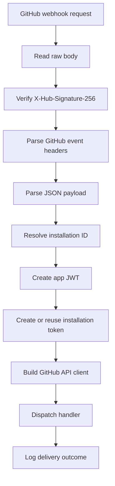
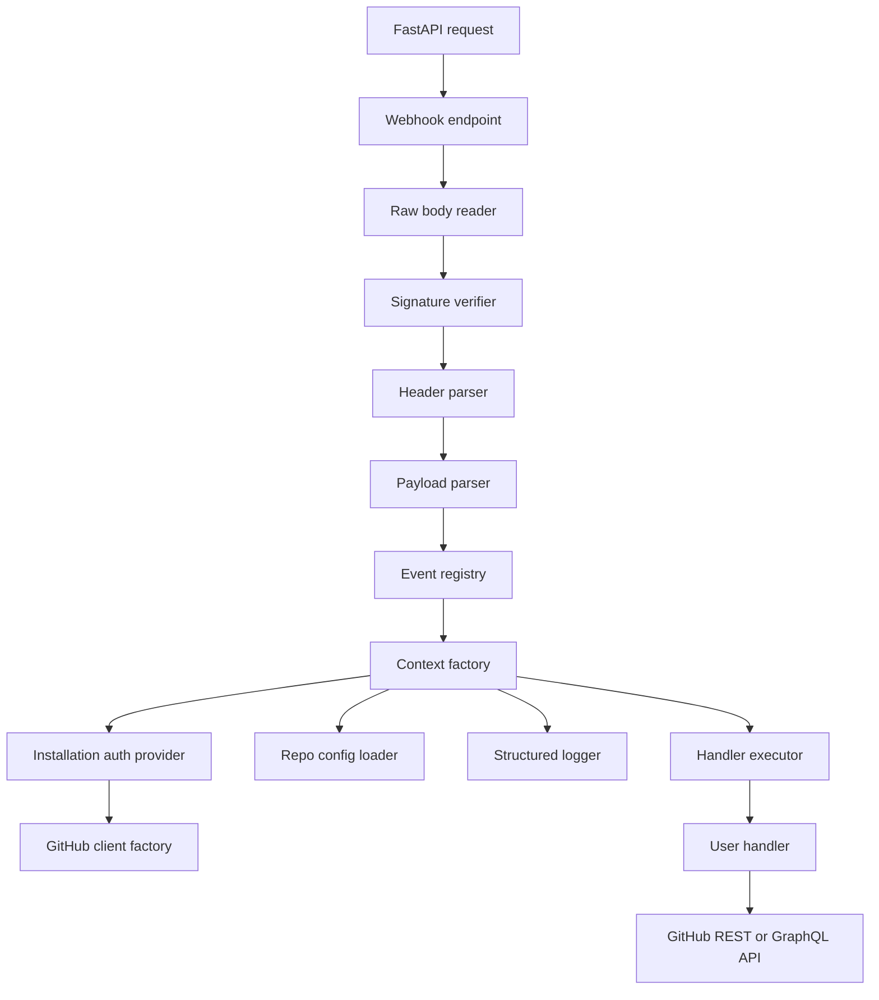

# RFC 0001: octoflow — FastAPI-native framework for enterprise-grade GitHub Apps

- **Status:** Proposed
- **Date:** 2026-05-08
- **Target repository:** `yu-iskw/octoflow`

## Summary

This RFC proposes building **octoflow** as a FastAPI-native framework for implementing production-grade GitHub Apps in Python.

The framework should let developers quickly build GitHub Apps by providing secure webhook handling, event routing, typed handler contexts, installation-scoped GitHub clients, repository-level configuration, background execution, structured logging, and testing utilities.

The core design is inspired by Probot, but should be idiomatic to Python, FastAPI, ASGI, Pydantic, `httpx`, and uv workspaces rather than a direct Node.js architecture port.

## Motivation

Building a GitHub App directly on FastAPI requires repeatedly implementing security-sensitive and operationally important plumbing:



This is boilerplate, but it is not trivial boilerplate. A reusable framework should make the secure and observable path the default.

Probot provides a proven product model in the JavaScript ecosystem: event handlers, GitHub API access through context, repository config loading, testing helpers, webhook simulation, structured logging, HTTP integration, pagination helpers, extension points, and persistence guidance.

octoflow should provide a comparable developer experience for Python/FastAPI users while preserving Python-native ergonomics.

## Goals

1. **One-hour useful app**: a developer should be able to create, test, and locally run a useful GitHub App in under one hour.
2. **FastAPI-native developer experience**: octoflow should compose naturally with FastAPI routers, dependency injection, lifespan hooks, testing, and ASGI deployment.
3. **Secure by default**: webhook signature verification, installation token handling, redaction, and safe logging should be built in.
4. **Composable enterprise posture**: queues, persistence, policy engines, observability, and tenancy isolation should be extension points rather than hard dependencies.
5. **Typed where useful**: common webhook events should have typed contexts and Pydantic models; unknown events should still work via raw dictionaries.
6. **Package-first distribution**: users should be able to install a package and mount it inside an existing FastAPI application.
7. **Separated GitHub client**: the GitHub API client should be usable independently from the FastAPI framework package.

## Non-goals for v1

v1 should not include:

- Admin UI
- Built-in persistent database management
- Built-in job queue system
- Full policy engine
- Complete generated GitHub REST client for every endpoint
- Marketplace or template registry
- Kubernetes operator
- Hosted SaaS control plane
- Full Probot compatibility layer

These can be explored as later packages or examples.

## Product shape

The primary public API should feel like a FastAPI extension:

```python
from fastapi import FastAPI
from pydantic import BaseModel

from octoflow import GitHubApp, GitHubAppSettings
from octoflow.events import IssueOpenedContext

api = FastAPI()

github = GitHubApp(
    settings=GitHubAppSettings.from_env(),
    config_file="octoflow.yml",
)


class OctoflowConfig(BaseModel):
    enabled: bool = True
    issue_greeting: str = "Thanks for opening this issue!"
    default_labels: list[str] = ["needs-triage"]


@github.on("issues.opened")
async def on_issue_opened(ctx: IssueOpenedContext) -> None:
    config = await ctx.config(OctoflowConfig)

    if config is not None and not config.enabled:
        ctx.log.info("octoflow_config_disabled")
        return

    await ctx.github.rest.issues.create_comment(
        owner=ctx.repo.owner,
        repo=ctx.repo.name,
        issue_number=ctx.payload.issue.number,
        body=config.issue_greeting if config else "Thanks!",
    )

    if config and config.default_labels:
        await ctx.github.rest.issues.add_labels(
            owner=ctx.repo.owner,
            repo=ctx.repo.name,
            issue_number=ctx.payload.issue.number,
            labels=config.default_labels,
        )


api.include_router(github.router(), prefix="/github")
```

## Proposed workspace layout

The repository should become a uv workspace with separately versionable packages.

```text
octoflow/
  pyproject.toml
  uv.lock
  README.md
  docs/
    rfcs/
      0001-octoflow-fastapi-github-app-framework.md
    adr/
      0001-use-uv-workspace-and-split-github-client.md
  packages/
    octoflow/
      pyproject.toml
      src/octoflow/
        __init__.py
        app.py
        settings.py
        routing.py
        context.py
        webhooks.py
        security.py
        execution.py
        config.py
        logging.py
        testing.py
        exceptions.py
        types.py
    octoflow-github/
      pyproject.toml
      src/octoflow_github/
        __init__.py
        auth.py
        client.py
        rest.py
        graphql.py
        pagination.py
        models.py
        errors.py
        rate_limit.py
        transport.py
    octoflow-testing/
      pyproject.toml
      src/octoflow_testing/
        __init__.py
        fixtures.py
        signatures.py
        fake_client.py
        simulator.py
  examples/
    issue-commenter/
    labeler/
    check-run-reporter/
    repo-config/
    custom-fastapi-routes/
  tests/
    integration/
    contract/
```

Package responsibilities:

| Package            | Responsibility                                                                          | Stability target                      |
| ------------------ | --------------------------------------------------------------------------------------- | ------------------------------------- |
| `octoflow`         | FastAPI integration, event routing, contexts, config loading, webhook handling, logging | Stable v1 API                         |
| `octoflow-github`  | GitHub App auth, installation token cache, REST/GraphQL transport, pagination           | Stable protocol; internals can evolve |
| `octoflow-testing` | Test helpers, signed payloads, simulated delivery, fake clients                         | Stable enough for app developers      |
| `examples/*`       | Reference applications                                                                  | Not API-stable                        |

## Core architecture



## Public API design

### Router integration

```python
api.include_router(github.router(), prefix="/github", tags=["github"])
```

Default endpoint:

```text
POST /github/webhooks
```

### Event handlers

```python
@github.on("issues.opened")
async def handle_issue(ctx: IssueOpenedContext) -> None:
    ...
```

Multiple event names should be supported:

```python
@github.on(["issues.opened", "issues.edited"])
async def handle_issue_change(ctx: IssueContext) -> None:
    ...
```

Catch-all handlers should be supported:

```python
@github.on_any()
async def audit_all_events(ctx: WebhookContext) -> None:
    ctx.log.info("github_webhook_received")
```

Error handlers should be supported:

```python
@github.on_error()
async def handle_error(error: HandlerError) -> None:
    error.log.exception("github_handler_failed")
```

## Webhook lifecycle

1. Receive request.
2. Read raw body bytes.
3. Validate `X-Hub-Signature-256`.
4. Parse GitHub headers:
   - `X-GitHub-Event`
   - `X-GitHub-Delivery`
   - `X-Hub-Signature-256`
   - `X-GitHub-Hook-ID`
   - `User-Agent`
5. Parse JSON payload.
6. Resolve qualified event name.
7. Match registered handlers.
8. Build typed context.
9. Submit handler execution.
10. Return `202 Accepted` by default.
11. Execute handlers through the configured executor.
12. Log success or failure with redaction.

## Event naming

Qualified event names should be derived as follows:

```python
if payload.get("action"):
    qualified_name = f"{headers.event}.{payload['action']}"
else:
    qualified_name = headers.event
```

Examples:

| Header event   | Payload action | octoflow name            |
| -------------- | -------------- | ------------------------ |
| `issues`       | `opened`       | `issues.opened`          |
| `pull_request` | `closed`       | `pull_request.closed`    |
| `push`         | none           | `push`                   |
| `workflow_run` | `completed`    | `workflow_run.completed` |

## Typed context

Base context:

```python
@dataclass(frozen=True)
class WebhookContext(Generic[PayloadT, ConfigT]):
    delivery_id: str
    event: str
    action: str | None
    payload: PayloadT
    raw_payload: dict[str, Any]
    installation_id: int | None
    repo: RepositoryRef | None
    sender: SenderRef | None
    github: GitHubClient
    log: BoundLogger
    request: Request | None

    async def config(
        self,
        model: type[ConfigT] | None = None,
        *,
        file_name: str | None = None,
        default: ConfigT | dict[str, Any] | None = None,
    ) -> ConfigT | dict[str, Any] | None:
        ...
```

Repository helper:

```python
ctx.repo.owner
ctx.repo.name
ctx.repo.params()
ctx.repo.params(path=".github/octoflow.yml")
```

Unknown events must remain usable:

```python
@github.on("repository_ruleset.created")
async def handle_new_event(ctx: WebhookContext[dict[str, Any]]) -> None:
    ...
```

## GitHub API client

Because the Python GitHub client ecosystem is fragmented, octoflow should define a client protocol and ship a default `httpx`-based implementation in `octoflow-github`.

```python
class GitHubClient(Protocol):
    rest: GitHubRestClient
    graphql: GitHubGraphQLClient

    async def request(
        self,
        method: str,
        path: str,
        *,
        params: Mapping[str, Any] | None = None,
        json: Any | None = None,
        headers: Mapping[str, str] | None = None,
    ) -> GitHubResponse:
        ...
```

Common helper calls should be ergonomic:

```python
await ctx.github.rest.issues.create_comment(...)
await ctx.github.rest.issues.add_labels(...)
await ctx.github.rest.checks.create(...)
await ctx.github.graphql(query, variables={...})
```

A generic request method must remain available for endpoints without helpers.

## Authentication and token management

Required settings:

```python
class GitHubAppSettings(BaseSettings):
    app_id: int
    webhook_secret: SecretStr
    private_key: SecretStr | None = None
    private_key_path: Path | None = None
    github_api_url: AnyHttpUrl = "https://api.github.com"
    github_web_url: AnyHttpUrl = "https://github.com"
    webhook_path: str = "/webhooks"
```

Token provider:

```python
class InstallationTokenProvider:
    async def get_token(
        self,
        installation_id: int,
        *,
        permissions: dict[str, str] | None = None,
        repository_ids: list[int] | None = None,
    ) -> InstallationToken:
        ...
```

The token cache should:

- key by installation ID plus requested permissions/repositories
- respect token expiry
- refresh before expiry with safety skew
- never log token values
- support pluggable stores later

## Repository configuration

Repository config should be first-class and Probot-style.

Default path:

```text
.github/octoflow.yml
```

Example:

```yaml
enabled: true
issue_greeting: "Thanks for opening this issue. The team will triage it soon."
default_labels:
  - needs-triage
```

Handler usage:

```python
class AppConfig(BaseModel):
    enabled: bool = True
    issue_greeting: str = "Thanks!"
    labels: list[str] = []


@github.on("issues.opened")
async def handle(ctx: IssueOpenedContext) -> None:
    config = await ctx.config(AppConfig)
    if not config.enabled:
        return
```

## Execution model

Default behavior should be:

```text
receive webhook -> verify -> schedule background task -> return 202
```

Built-in executors:

| Executor                    | Purpose                     |
| --------------------------- | --------------------------- |
| `InlineExecutor`            | Tests and local debugging   |
| `FastAPIBackgroundExecutor` | Default v1 behavior         |
| `NoopExecutor`              | Contract tests and dry runs |

Future executor integrations should live outside the core package or as examples:

- Celery
- Arq
- Dramatiq
- SQS
- Cloud Tasks
- Pub/Sub

## Logging and auditability

Every delivery log should include fields such as:

```json
{
  "component": "octoflow",
  "event": "issues",
  "action": "opened",
  "qualified_event": "issues.opened",
  "delivery_id": "...",
  "installation_id": 123,
  "repository": "owner/repo",
  "sender": "octocat",
  "handler": "welcome_issue",
  "status": "success",
  "duration_ms": 42
}
```

Never log:

- installation access tokens
- JWTs
- webhook secrets
- private keys
- `Authorization` headers
- raw webhook payload by default
- user-provided issue/comment bodies at info level

## Testing and simulation

Testing utilities should make app behavior testable without real GitHub network calls.

```python
from octoflow.testing import OctoflowTestClient, payload_fixture, test_settings


async def test_issue_opened_posts_comment() -> None:
    github = GitHubApp(settings=test_settings())

    @github.on("issues.opened")
    async def handler(ctx):
        await ctx.github.rest.issues.create_comment(
            owner=ctx.repo.owner,
            repo=ctx.repo.name,
            issue_number=ctx.payload.issue.number,
            body="Hello",
        )

    client = OctoflowTestClient(github)
    client.github.expect_request(
        method="POST",
        path="/repos/acme/demo/issues/1/comments",
        json={"body": "Hello"},
        response_json={"id": 123},
    )

    await client.receive("issues.opened", payload=payload_fixture("issues.opened"))

    client.github.assert_all_called()
```

## Security requirements

Must-have:

- Verify `X-Hub-Signature-256`.
- Use raw request bytes for signature verification.
- Use constant-time comparison.
- Reject unsigned webhooks by default.
- Never log secrets.
- Use secret-aware settings types for sensitive values.
- Support private key from env or file.
- Redact tokens in errors.
- Bind logs to delivery ID and installation ID.
- Avoid raw payload logs by default.

Should-have:

- Optional idempotency store
- Replay detection through delivery ID
- Per-installation isolation hooks
- Permission check helper
- Configurable allowed event list
- GitHub Enterprise Server base URL support

## v1 typed event coverage

Start with high-value events:

| Event                             | Typed context |
| --------------------------------- | ------------- |
| `issues.opened`                   | yes           |
| `issues.edited`                   | yes           |
| `issues.closed`                   | yes           |
| `issue_comment.created`           | yes           |
| `pull_request.opened`             | yes           |
| `pull_request.synchronize`        | yes           |
| `pull_request.closed`             | yes           |
| `push`                            | yes           |
| `check_suite.completed`           | yes           |
| `check_run.completed`             | yes           |
| `workflow_run.completed`          | yes           |
| `installation.created`            | yes           |
| `installation.deleted`            | yes           |
| `installation_repositories.added` | yes           |

## Error handling

Error types:

```python
class OctoflowError(Exception): ...
class WebhookSignatureError(OctoflowError): ...
class WebhookHeaderError(OctoflowError): ...
class PayloadParseError(OctoflowError): ...
class EventModelError(OctoflowError): ...
class InstallationAuthError(OctoflowError): ...
class GitHubApiError(OctoflowError): ...
class RepoConfigError(OctoflowError): ...
class HandlerExecutionError(OctoflowError): ...
```

HTTP response behavior:

| Failure                     | Response |
| --------------------------- | -------- |
| Missing signature           | `401`    |
| Invalid signature           | `401`    |
| Missing event header        | `400`    |
| Invalid JSON                | `400`    |
| No matching handler         | `202`    |
| Handler scheduled           | `202`    |
| Internal scheduling failure | `500`    |

Handler failures after `202` should be logged and routed to `on_error` hooks.

## Implementation plan

### Phase 0: Repository initialization

- Rename placeholder package.
- Convert root to uv workspace.
- Add `packages/octoflow`.
- Add `packages/octoflow-github`.
- Add `packages/octoflow-testing`.
- Keep current quality tooling: uv, Hatchling, Ruff, Pyright, Pylint, Bandit, Semgrep, Trivy, pytest, and CodeQL.

### Phase 1: Webhook receiver

- FastAPI router
- Raw body reader
- Signature verifier
- Header parser
- Delivery model
- Default `POST /webhooks`
- Unit tests for valid and invalid signatures

### Phase 2: Event registry and dispatch

- `@github.on(...)`
- `@github.on_any()`
- `@github.on_error()`
- Event name resolution
- `InlineExecutor`
- Test-only `receive(...)`

### Phase 3: Context and typed events

- `WebhookContext`
- `RepositoryRef`
- `SenderRef`
- Typed event models for issues and pull requests
- Raw fallback context

### Phase 4: GitHub auth and client

- GitHub App JWT generation
- Installation token provider
- In-memory token cache
- Default `httpx` transport
- Generic REST request
- GraphQL request
- Basic resource helpers

### Phase 5: Repository config

- `.github/octoflow.yml` loader
- Pydantic validation
- Default config support
- Config file override
- Optional TTL cache

### Phase 6: Background execution

- `FastAPIBackgroundExecutor`
- Default `202 Accepted`
- Error hook integration
- Structured handler logs

### Phase 7: Testing package

- `OctoflowTestClient`
- Signed webhook helper
- Payload fixtures
- Fake GitHub client
- Mocked token provider

### Phase 8: Documentation and examples

- README quickstart
- Hello World issue commenter
- Repository config guide
- GitHub App setup guide
- Deployment guide
- Testing guide
- Enterprise security guide
- API reference

## Milestone acceptance criteria

| Milestone           | Acceptance criteria                                                              |
| ------------------- | -------------------------------------------------------------------------------- |
| M0 repo setup       | `uv sync`, package tests, lint, and type checks run successfully                 |
| M1 webhook receiver | Valid GitHub-style signed payload returns `202`; invalid signature returns `401` |
| M2 dispatch         | `@github.on("issues.opened")` receives a context in tests                        |
| M3 auth/client      | Handler can call GitHub API through installation-scoped client                   |
| M4 config           | Handler can load and validate `.github/octoflow.yml`                             |
| M5 background       | Webhook returns before handler completion with FastAPI background task           |
| M6 testing          | App behavior can be tested without real GitHub network calls                     |
| M7 docs             | New developer can build the issue-commenter example in under one hour            |

## Architectural trade-offs

| Decision        | Choice                                   | Why                                                    | Trade-off                                   |
| --------------- | ---------------------------------------- | ------------------------------------------------------ | ------------------------------------------- |
| Framework style | FastAPI-native decorators                | Best fit for Python users                              | Less direct Probot compatibility            |
| GitHub client   | Separate package plus protocol           | Avoids coupling framework to one client implementation | More initial design work                    |
| Typing          | Pydantic for common events, raw fallback | Good DX without blocking new GitHub events             | Partial model coverage initially            |
| Execution       | FastAPI background tasks by default      | Simple and fast to adopt                               | Not durable like queues                     |
| Config          | Probot-style repo YAML                   | Familiar and useful                                    | Requires GitHub content fetches and caching |
| Persistence     | Out of core                              | Keeps v1 focused                                       | Users implement state themselves            |
| Workspace       | uv workspace                             | Clean package separation and shared lockfile           | Slightly more repo setup complexity         |
| Security        | Verification required by default         | Correct and enterprise-safe                            | Local tests need helpers                    |

## Open questions

1. Should `octoflow-github` initially use only `httpx`, or wrap an existing third-party client?
2. Should v1 require Python 3.11+ or support Python 3.10?
3. Should event models be hand-written for v1 or generated from GitHub webhook schemas?
4. Should `octoflow-testing` be separate from day one or live under `octoflow.testing` until APIs stabilize?
5. Should the default config file be `.github/octoflow.yml`, `.github/octoflow.yaml`, or support both?
6. Should webhook handlers return values, or should all side effects be explicit?
7. Should octoflow expose FastAPI dependencies for settings, current delivery, and client access?
8. Should idempotency be built into v1 or documented as an enterprise extension?

## Recommendation

Implement octoflow as a **practical FastAPI-native framework** with a uv workspace split:

```text
packages/octoflow          # FastAPI framework
packages/octoflow-github   # GitHub App auth and REST/GraphQL client
packages/octoflow-testing  # testing and simulation utilities
```

The first public release should optimize for:

```text
install package -> create FastAPI app -> register @github.on handler
-> receive signed webhook -> run handler -> call GitHub API
-> test locally without GitHub network access
```

The product identity should be:

> Probot-inspired, FastAPI-native, enterprise-safe GitHub App development for Python.
